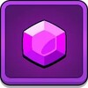

    <h2 style="border-bottom: 1px solid #d8dee4; color: #282d33;"> 🛠️ Tech Stacks 🛠️ </h2>   
    
 
      
      
      
      
    

    <h2 style="border-bottom: 1px solid #d8dee4; color: #282d33;"> 📚 Studying 📚 </h2>   
    
 
      
      
    

    <h2 style="border-bottom: 1px solid #d8dee4; color: #282d33;"> 🎨 Unity Projects 🎨 </h2>   
  

    <h2 style="border-bottom: 1px solid #d8dee4; color: #282d33;"> 🎨 C++ Projects 🎨 </h2>   
  

<!--
**Hwang2442/Hwang2442** is a ✨ _special_ ✨ repository because its `README.md` (this file) appears on your GitHub profile.

Here are some ideas to get you started:

- 🔭 I’m currently working on ...
- 🌱 I’m currently learning ...
- 👯 I’m looking to collaborate on ...
- 🤔 I’m looking for help with ...
- 💬 Ask me about ...
- 📫 How to reach me: ...
- 😄 Pronouns: ...
- ⚡ Fun fact: ...
-->
